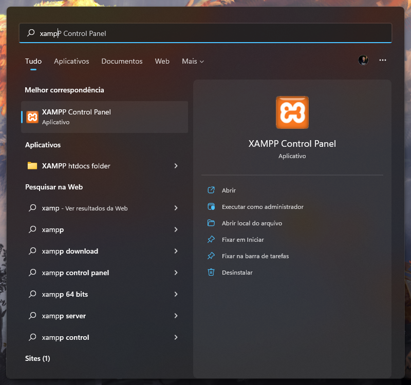
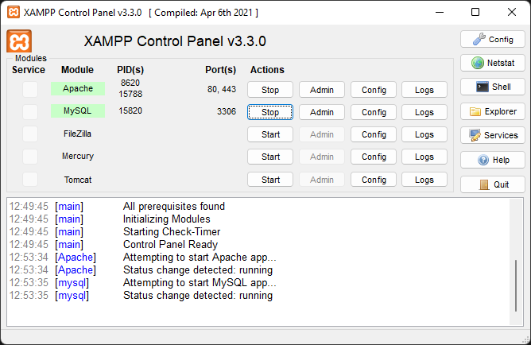
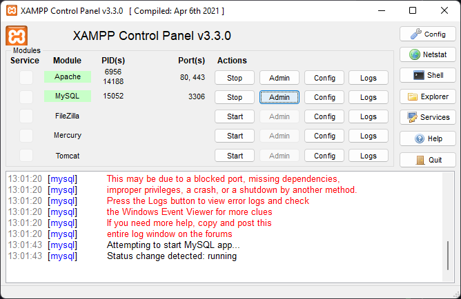
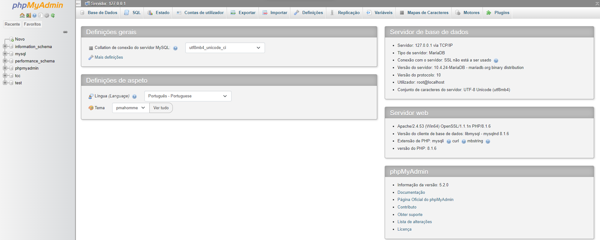
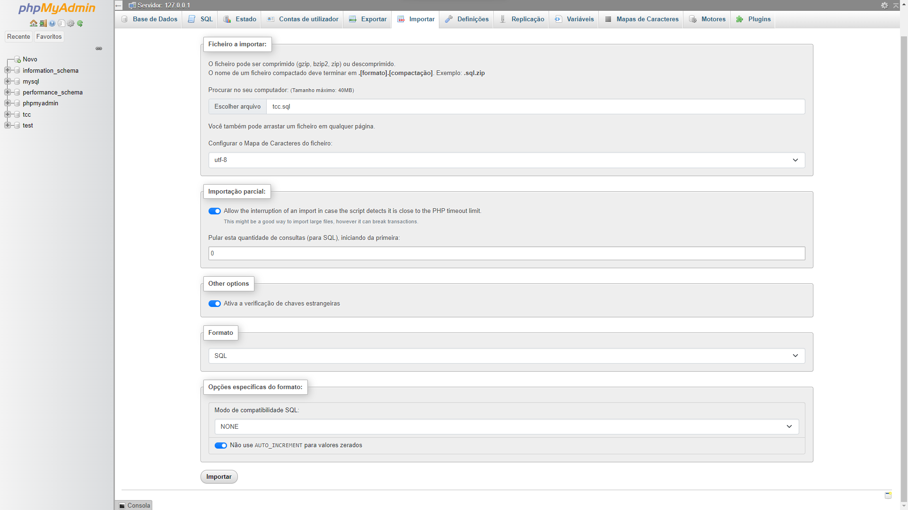
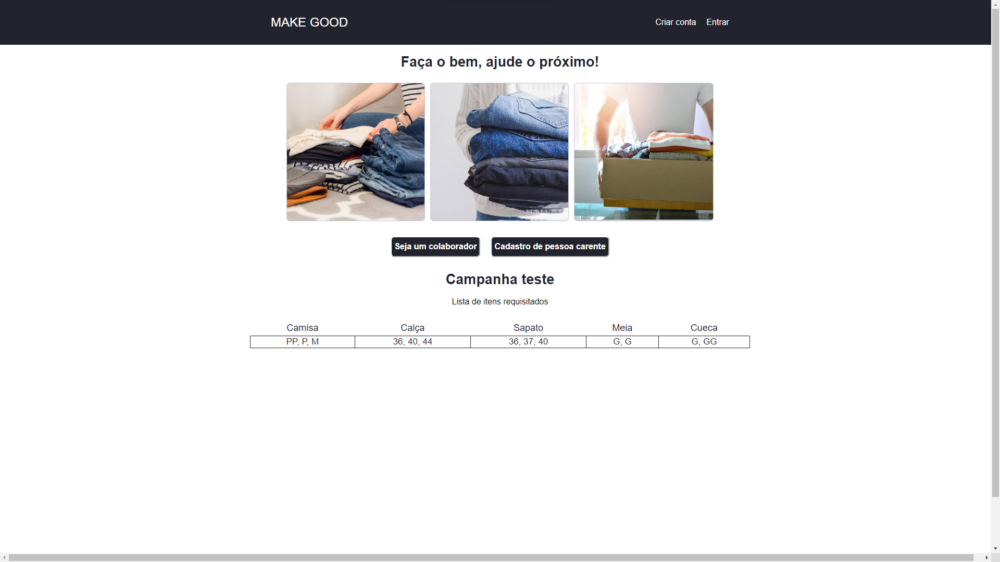
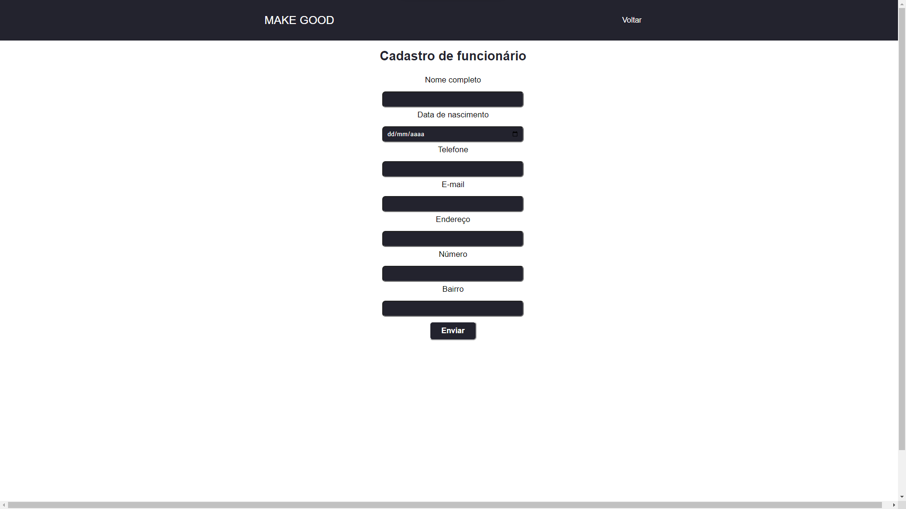

# README GitHub

# **Sistema Web Para o Gerenciamento de Doações de Roupas**

**Danton R. Abreu, Iverton Adão S. Santos**

1Tecnologia em Análise e Desenvolvimento de Sistemas - Instituto Federal de Educação, Ciência e Tecnologia Farroupilha Campus Alegrete (IFFar) Alegrete - RS -Brasil [danton.2019014677@aluno.iffar.edu.br](mailto:danton.2019014677@aluno.iffar.edu.br) [iverton.santos@iffarroupilha.edu.br](mailto:iverton.santos@iffarroupilha.edu.br)

**Resumo**. Este trabalho de conclusão de curso tem como objetivo criar um sistema capaz de auxiliar no gerenciamento de doações de roupas e melhorar a seleção das pessoas que devem recebê-las. A partir de um sistema web será possível gerenciar roupas recebidas, cadastrar pessoas carentes, cadastrar doadores interessados e criar campanhas com o intuito de arrecadar mais roupas. Dessa forma, as Organizações Não Governamentais terão um banco de dados com o registro de pessoas que necessitam de doações e não apenas maior quantidade, mas principalmente um melhor gerenciamento do estoque de roupas e distribuição de peças para as pessoas de acordo com as informações persistidas no sistema.

## Como instalar o sistema

1. Instalar ambiente para o PHP (Utilizei o [Xamp](https://www.apachefriends.org/pt_br/index.html)).
2. Clonar o repositorio dentro da pasta de instalação do xamp `xampp\htdocs\`
3. Executar o xamp control panel
    
    
    
4. Startar **Apache** e **MySQL**.
    
    
    
5. Clicar em **admin** na opção MySQL.
    
    
    
6. A tela do PhpMyAdmin será aberta, selecione **importar** localizado na parte superior da tela.
    
    
    
7. Na tela de importação clique em **escolher arquivo**, então navague até a pasta `xampp\htdocs\TCC` e selecione o arquivo `tcc.sql`.  Logo após clique em **importar** localizado na parte inferior da página
    
    
    
8. Abra seu navegador preferido e digite a url [http://localhost/TCC/](http://localhost/TCC/). A tela seguinte deve ser exibida.
    
    
    
9. Logo após deve clicar no campo [Criar conta](http://localhost/TCC/cadastro_funcionario.php) e inserir os dados solicitados.
    
    
    
10. Após isso basta acessar a tela inicial (tópico 8) novamente e clicar em [Entrar](http://localhost/TCC/login_funcionario.php) e inserir seus usuário e senha cadastrados.
    
    